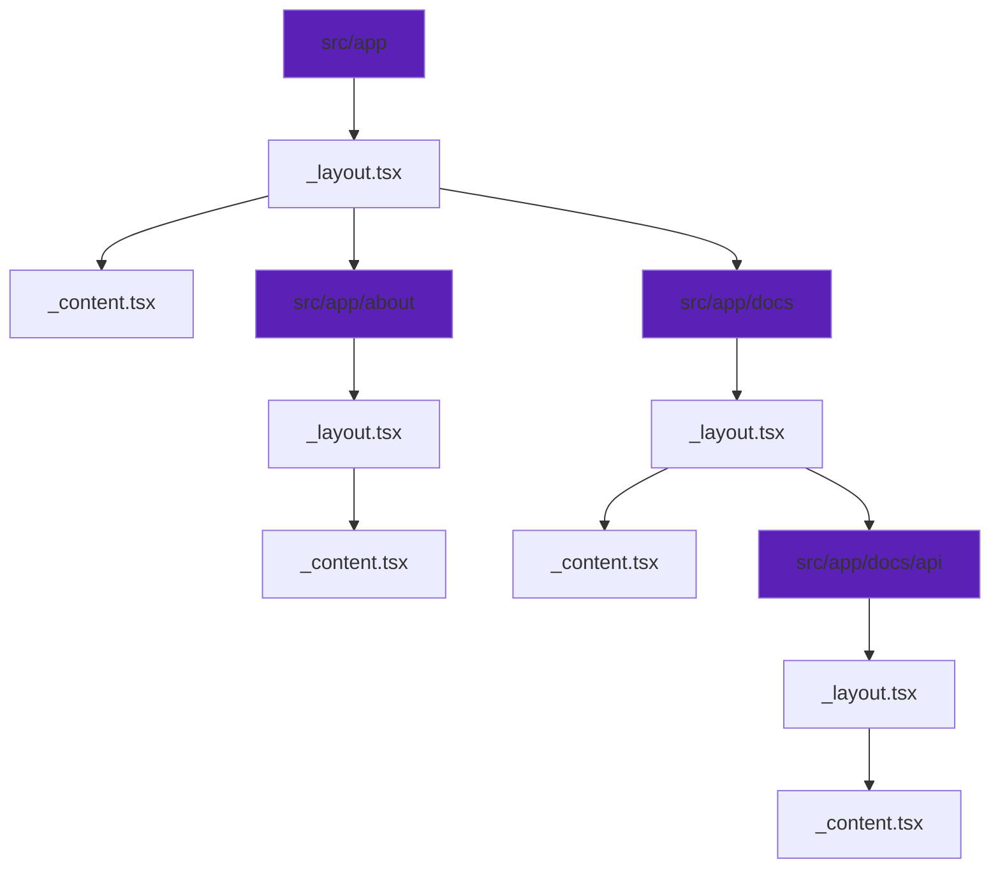
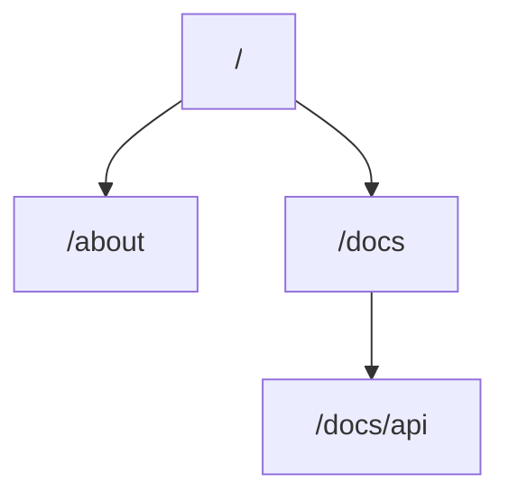

# Routes

In the application, routes are defined using a tree structure of folders and files.
Each route comprises:

1. Folders (e.g., `src/app/about`).

   The folder name determines the URL pattern of the route.

2. Files within folders (e.g., `src/app/about/_layout.tsx`, `src/app/about/_content.tsx`).

   These files define the content rendered when the route is matched.
   The following files serve specific purposes:

   - [\_layout.tsx](/docs/routes/_layout): Defines the layout for the route.
   - [\_content.tsx](/docs/routes/_content): Specifies the route's content.
   - [\_fallback.tsx](/docs/routes/_fallback): Content rendered for "not found" cases.

Content is nested and recursively wrapped in the layout and content of its parent routes.

## Example

For this folder structure:

The following routes are generated:

- The root route `/` is defined by `src/app/\_layout.tsx` and `src/app/\_content.tsx`.
- The `/about` route inherits its structure from `src/app/about/\_layout.tsx` and `src/app/about/\_content.tsx`.
- Nested routes like `/docs/api` inherit and extend their parent routes, using
  their respective `\_layout.tsx` and `\_content.tsx` files.
