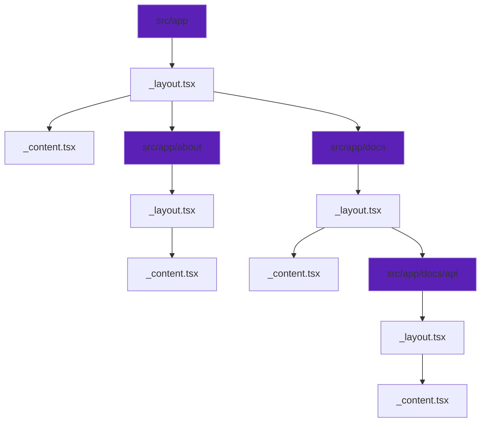
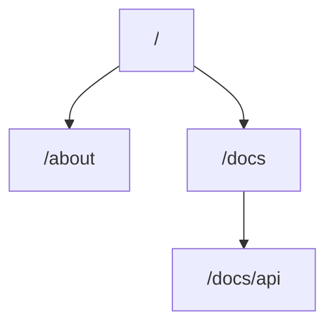

# Routing

In application routes are defined by a tree of folders and files.
Any route consists of:

- Folder (e.g. `src/app/about`).

  Name of the folder declares route url pattern.

- Files inside the folder (e.g. `src/app/about/_layout.tsx`,
  `src/app/about/_content.tsx`, etc.).

  Define content which is rendered when the route is matched. Following files
  define corresponding aspects of the route:

  - [\_layout.tsx](/docs/api/_layout) - content layout.
  - [\_content.tsx](/docs/api/_content) - route's content.
  - [\_void.tsx](/docs/api/_content) - content, rendered in "not found" case.

Route's content is always nested and wrapped recursively in parent content.

For example, this folder layout:

Defines these routes:

