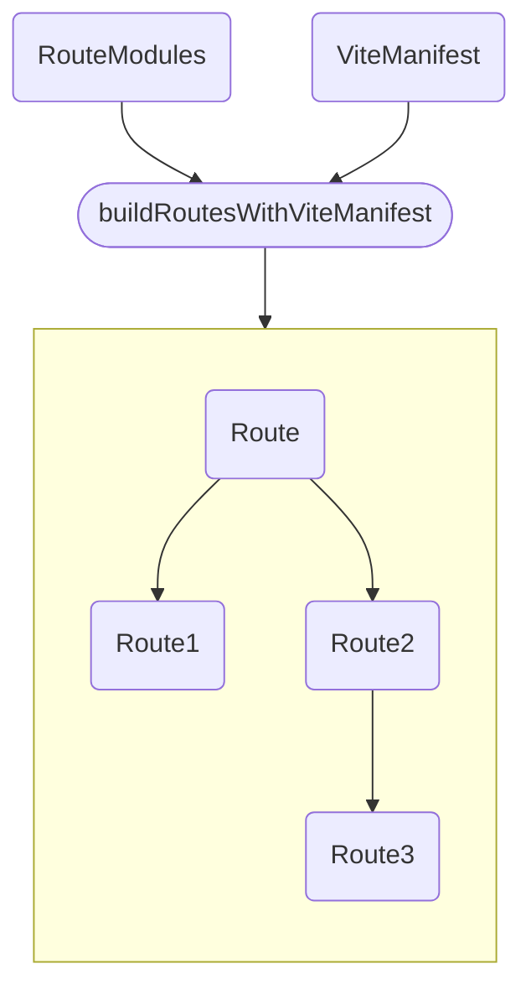

# Building Routes

See also: [Route](/docs/api/route).

```mermaid
graph TB
  RM(RouteModules)
  VM(ViteManifest)
  BR([buildRoutesWithViteManifest])
  subgraph RTT [" "]
    direction TB

    RT(Route)
    RT1(Route1)
    RT2(Route2)
    RT3(Route3)

    RT-->RT1
    RT-->RT2
    RT2-->RT3
  end;

  RM-->BR
  VM-->BR
  BR-->RTT
```
