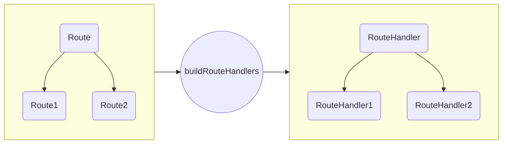
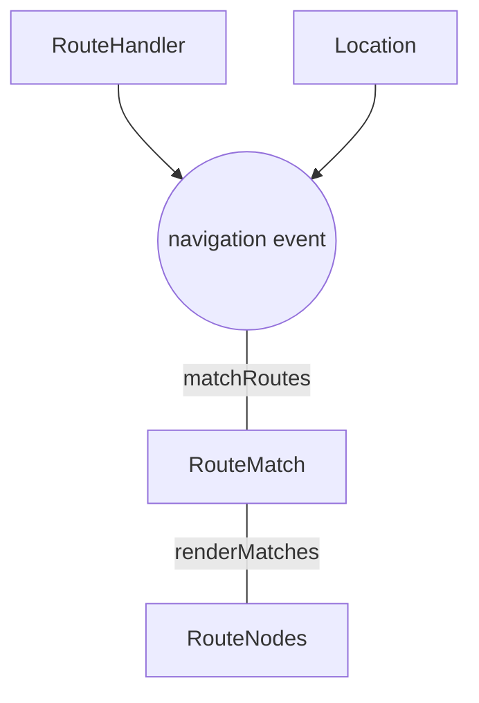

## Building RouteHandlers

```mermaid
graph LR;
  subgraph RTT [" "]
    RT(Route)
    RT1(Route1)
    RT2(Route2)

    RT-->RT1
    RT-->RT2
  end
  subgraph RHH [" "]
    RH(RouteHandler)
    RH1(RouteHandler1)
    RH2(RouteHandler2)

    RH-->RH1
    RH-->RH2
  end
  BRH((buildRouteHandlers))

  RTT-->BRH
  BRH-->RHH
```

## TODO

```mermaid
graph TD;
  RH[RouteHandler];
  NAV(("navigation event"));
  LOC[Location];
  RM[RouteMatch];
  RN[RouteNodes];

  RH-->NAV;
  LOC-->NAV;
  NAV---|matchRoutes|RM;
  RM---|renderMatches|RN;
```
